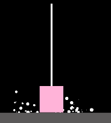
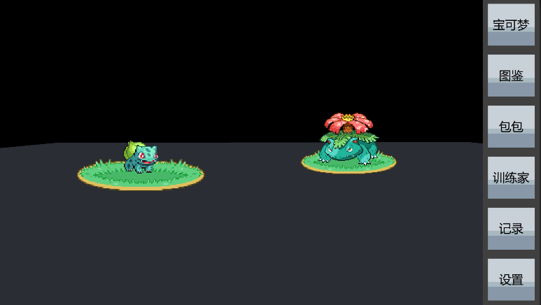
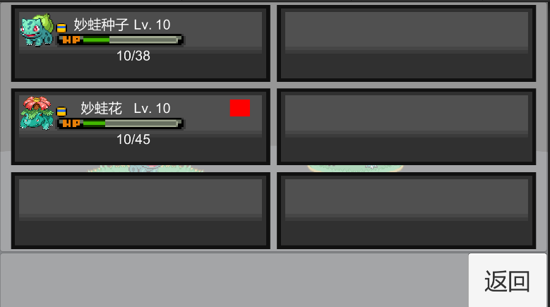
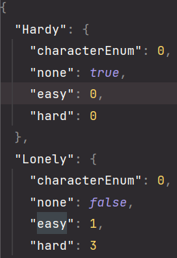

# Unity Start Project

`Nico->学习unity的代码仓库,以复刻经典游戏为目标,学习Unity游戏创建`

## 已经实现的游戏demo

### 2D平台跳跃游戏

>实现一个平台跳跃游戏

> 期望通过这个demo,学习unity的基本知识,包括物理系统,摄像机跟随,基本的组件,粒子系统,音效播放

| `了解Unity编辑器的基本使用` | `使用物理组件的碰撞检测,实现具有很好手感的跳跃` | `初步学习了粒子系统,并制作了跳跃/跑步的粒子特效` | `学习了AudioListener的基本使用,有三种音效` |
| --------------------------- | ----------------------------------------------- | ------------------------------------------------ | ------------------------------------------ |

|  |  |
| ------------------------------------------------------------ | ------------------------------------------------------------ |

### Pokemon

>复刻宝可梦游戏的UI

>期望通过这个demo 学会UGUI的基本使用,包括EventSystem,Canvas,Panel,Image,Button,....组件
>
>同时学会使用C#的JSON序列化存储游戏数据,将程序和数据分离

|  |  |
| ------------------------------------------------------------ | ------------------------------------------------------------ |
|  |                                                              |

